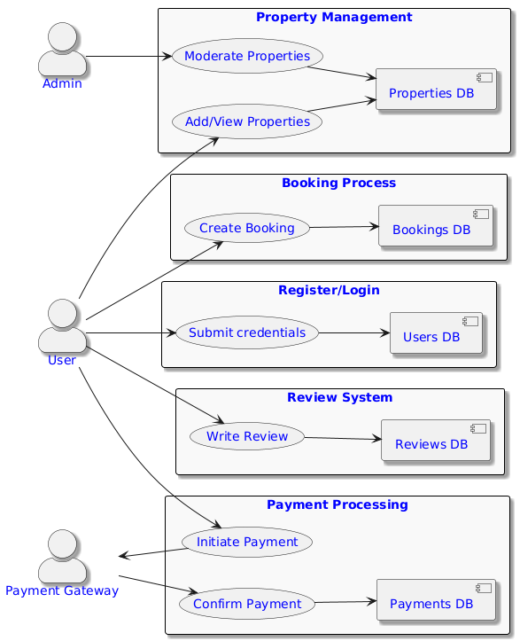

# 📥 Data Flow Diagram

This directory contains the **Data Flow Diagram (DFD)** for the backend architecture of the Airbnb Clone project.

---

## 🎯 Objective

To visually demonstrate how data flows within the backend system and how different external actors interact with internal processes and data stores.

---

## 🗂️ Diagram Components

### 🔷 External Entities
- **User**: Represents both guests and hosts who interact with the system.
- **Admin**: Platform administrator responsible for moderation and user management.
- **Payment Gateway**: External service used to process payments securely.

### 🔸 Core Processes
- **Authentication (Register/Login)**: Manages user registration, login, and session control.
- **Property Management**: Enables hosts to list, update, or delete properties; allows users to view listings.
- **Booking System**: Allows guests to search, reserve, and cancel bookings for properties.
- **Payment Processing**: Facilitates secure financial transactions through integration with an external payment gateway.
- **Review Module**: Allows users to write and manage reviews for listed properties.

### 🗄️ Data Stores
- `Users DB`: Stores user credentials and profile data.
- `Properties DB`: Stores property listings and details.
- `Bookings DB`: Stores booking records and availability data.
- `Payments DB`: Stores transaction history and payment data.
- `Reviews DB`: Stores user-generated property reviews.

---

## 🖼️ Data Flow Diagram

