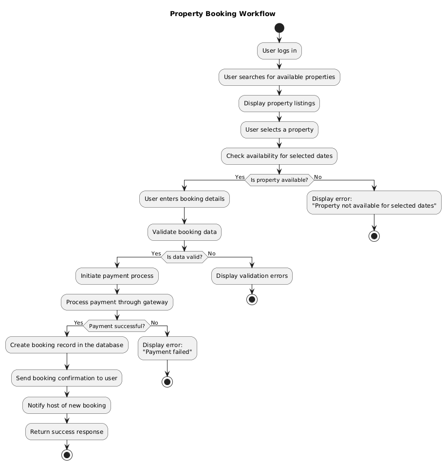

# 🏠 Property Booking Flowchart

This document outlines the backend process of property booking in the **Airbnb Clone** system, visualized through a detailed flowchart using PlantUML.

---

## 📌 Objective

To illustrate the complete flow of booking a property from the user's perspective, including decision points, validations, and interactions with the payment system and database.

---

## 🧩 Flowchart Overview

The diagram visualizes the following key steps:

1. **User Authentication**
   - The user must be logged in to access the booking system.

2. **Property Discovery**
   - Users search for available properties and view listings.

3. **Availability Check**
   - The system verifies whether the selected property is available for the specified dates.

4. **Booking Details Input**
   - Users provide required booking information.

5. **Validation & Payment**
   - Inputs are validated.
   - If valid, the system initiates a payment request through the payment gateway.

6. **Booking Confirmation**
   - On successful payment:
     - Booking is saved in the database.
     - Confirmation is sent to the user.
     - Notification is sent to the host.

7. **Error Handling**
   - The system handles issues such as unavailable dates, validation errors, or failed payments gracefully.

---

## 📊 Flowchart

