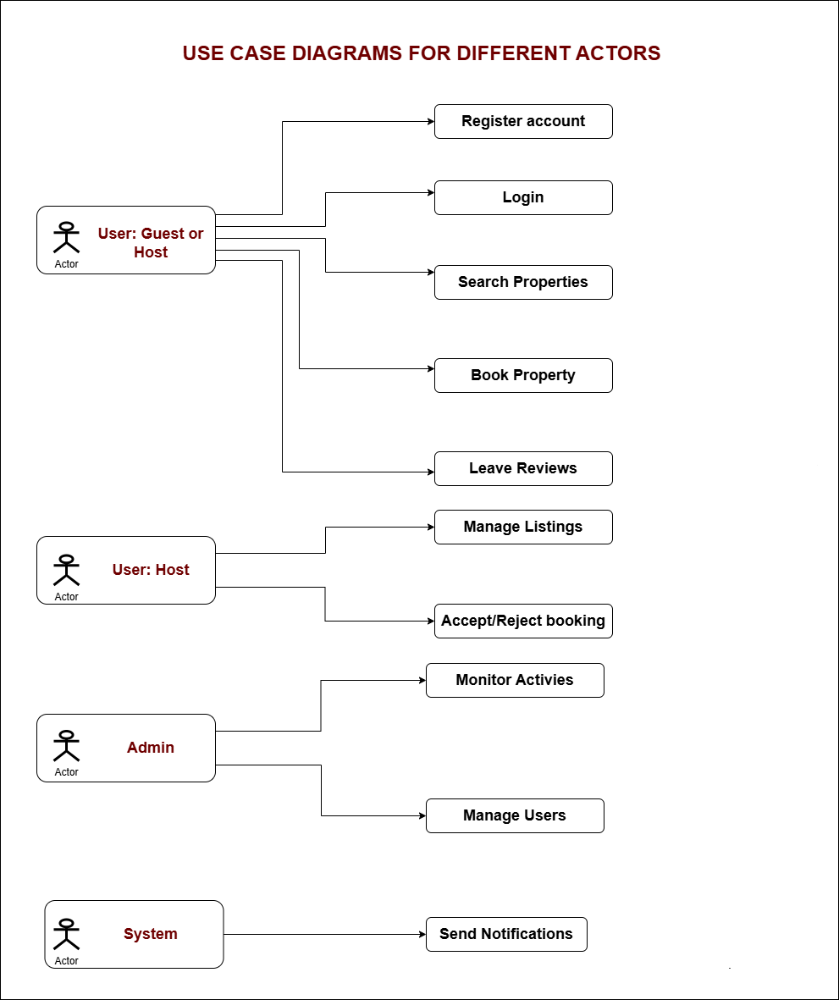

# Use Case Diagram

The use case diagram shows the main interactions between different actors and the property reservation system. The actors include:

- Guests : Users looking to book properties
- Hosts : Property owners who list their properties
- Administrators : System managers
- Payment System : External payment processing service

---

## Main Features

1. Registration and Authentication
   
   - User registration
   - User login

2. Property Management
   
   - Property search
   - Property details viewing
   - Listing creation (for hosts)
   - Property management (for hosts)

3. Reservation System
   
   - Property booking
   - Reservation management
   - Payments
   - Reviews and comments

4. Administration
   
   - System management by administrators

---

## Use Case Diagram

